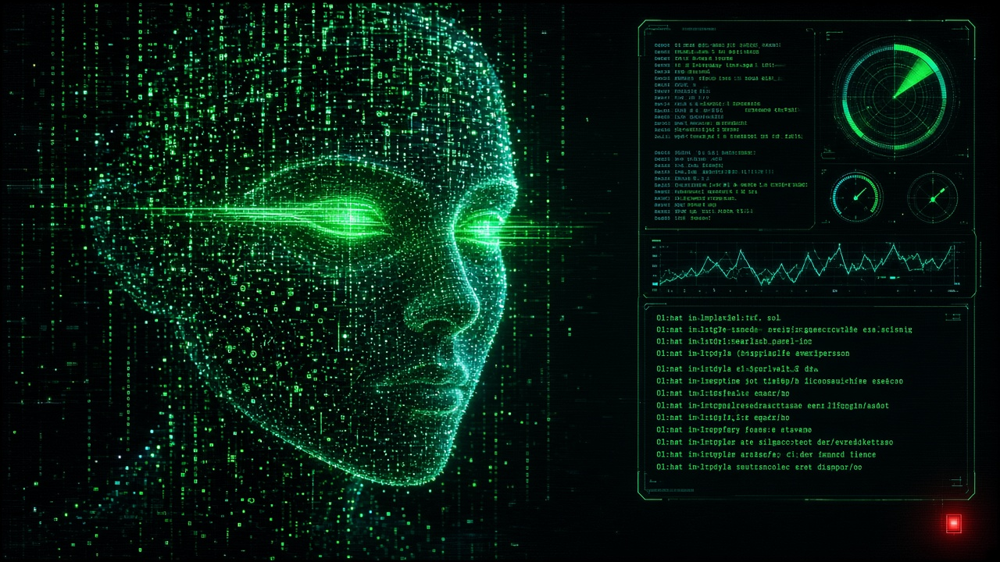

# THE ENTITY


[](https://v2.tauri.app)
[](https://www.rust-lang.org)
[](https://www.typescriptlang.org)
[](https://react.dev)
[](https://threejs.org)
[](https://vite.dev)


A futuristic multi-provider AI chat client built with **Tauri 2** (Rust) + React + Three.js.
A face made of light lives next to the chat, and it **contorts in real time** based on telemetry
streamed from the Rust backend: token throughput, model confidence (from token logprobs), and errors.

## Providers

Models are discovered live from each provider's API, so new releases show up without an app update.

| Link | API | Key |
| --- | --- | --- |
| Ollama Cloud | `https://ollama.com/api` | `OLLAMA_API_KEY` |
| Ollama (local) | `http://localhost:11434/api` | — |
| OpenAI | `/v1/chat/completions` | `OPENAI_API_KEY` |
| Anthropic | `/v1/messages` | `ANTHROPIC_API_KEY` |
| Google Gemini | OpenAI-compatible endpoint | `GEMINI_API_KEY` |
| xAI Grok | OpenAI-compatible | `XAI_API_KEY` |
| Groq | OpenAI-compatible | `GROQ_API_KEY` |
| OpenRouter | OpenAI-compatible | `OPENROUTER_API_KEY` |
| DeepSeek | OpenAI-compatible | `DEEPSEEK_API_KEY` |
| Mistral | OpenAI-compatible | `MISTRAL_API_KEY` |
| Custom | any OpenAI-compatible server (LM Studio, vLLM, llama.cpp…) | optional |
| Simulator | offline, in the UI — for demoing the entity | — |

Keys can be set as environment variables or pasted into **CONFIG**. Stored keys live in the app
config directory (`settings.json`, mode `600`) and are never sent back to the webview.

## The entity

Three renderers, switchable from the stage (`MATRIX / ASCII / VECTOR`), all driven by the same signals:

| Uniform | Source (Rust) | Effect |
| --- | --- | --- |
| `u_tokens_per_second` | sliding 1.5 s window over streamed chunks (exact `eval_count/eval_duration` from Ollama at the end) | speeds up noise, scanlines, data rain, particle outflow |
| `u_model_confidence` | geometric mean of the last 24 token probabilities when the provider returns logprobs (`EST` otherwise) | low values shatter the voxel lattice into code glyphs, dissolve the SDF, rip SVG anchors |
| `u_error_state` | spikes to 1 on HTTP/stream errors, holds, then decays | sine-wave geometry warp, red palette, screen tearing, RGB split |

1. **MATRIX (GLSL)** — a signed-distance-field head is raymarched once per voxel cell into a small
   render target, then a composite pass draws beveled tiles, glyph blocks, log-polar particle spray,
   matrix rain, tearing and chromatic aberration.
2. **ASCII (Three.js)** — a sphere is shrink-wrapped onto the same SDF, displaced with Perlin noise
   whose frequency/amplitude scale with activity, melts on errors, and is converted to a glyph ramp
   (` .:-=+*S%#@`) from a tiny render target.
3. **VECTOR (SVG)** — a wireframe of contour lines whose anchor points are spring-simulated.
   A successful completion snaps them into cold symmetry; errors and low confidence kick them apart.

The **STIMULUS** buttons (SURGE / DOUBT / GLITCH / STABILIZE) let you exercise each state manually.

## Download

Installers are built for macOS (Apple silicon and Intel), Windows, and Linux (x64 and arm64) and attached to [GitHub releases](https://github.com/AaronGrace978/Intelligence-Driven-Entity/releases).

### Steam Deck

In Desktop Mode, open Konsole and run:

```bash
curl -fsSL https://github.com/AaronGrace978/Intelligence-Driven-Entity/releases/latest/download/install-steam-deck.sh | bash
```

It installs the x86_64 AppImage under `~/.local/share/the-entity` with an application-menu entry and a desktop icon, without root. Run it again to update, or add `--uninstall` to remove it. For Game Mode, right-click The Entity in the application menu and choose **Add to Steam**.

On a Deck the app:

- opens sized to the 1280×800 panel in Desktop Mode and in Game Mode;
- keeps WebKit's GPU compositor on in Game Mode, the same DMABUF path Desktop Mode uses, with the scale pinned to 1 so taps still land;
- caps rendering at 60 fps while the model talks and 30 fps at idle, at pixel ratio 1, without the CRT blend layer, SVG blur, or per-frame glyph glow;
- offers an optional **GPU LITE** shader, on by default and switchable back to **GPU FULL** from the stage. Lite is Deck-only: 32 raymarch steps instead of 72, no noise inside the march, no ambient-occlusion sample, one particle shell, no chromatic split, a 72-row voxel grid, and the march is skipped on idle frames. A desktop session never uses it;
- shows an on-screen keyboard when a text field has focus.

In Game Mode the controller drives the UI:

| Input | Action |
| --- | --- |
| D-pad / left stick | move focus |
| A | press, or type the highlighted key |
| B | back: close a menu or the keyboard, or stop a reply |
| X | focus the message box (delete on the keyboard) |
| Y, LB / RB | switch renderer (Y is space and LB is shift on the keyboard) |
| ☰ Menu | CONFIG (send on the keyboard) |
| ⧉ View | model list |
| LT / RT | scroll |
| right stick | steer the entity's gaze |

In Desktop Mode the controller is left to Steam's desktop layout (trackpad mouse, triggers click), so presses are not handled twice. `ENTITY_DECK=1` or `ENTITY_DECK=0` overrides Deck detection.

If WebGL is unavailable, MATRIX and ASCII fall back to the VECTOR renderer.

### Signing

macOS builds are ad-hoc signed and not notarized. If macOS reports the app as damaged or from an unidentified developer, right-click it and choose Open, or allow it under System Settings → Privacy & Security. Windows builds are not Authenticode-signed. The Linux `.deb` needs WebKitGTK 4.1 (Ubuntu 22.04+ or Debian 12+); the `.AppImage` does not.

## Develop

Prerequisites: Node 20+, pnpm, Rust (stable), and the [Tauri 2 system dependencies](https://v2.tauri.app/start/prerequisites/)
(on Debian/Ubuntu: `libwebkit2gtk-4.1-dev build-essential libssl-dev libayatana-appindicator3-dev librsvg2-dev libudev-dev`).

```bash
pnpm install
pnpm tauri dev      # desktop app
pnpm dev            # browser-only preview (simulator provider only)
pnpm tauri build    # release bundles
```

## Layout

```
src-tauri/src/
  providers.rs   provider registry (wire format, base URL, env key, fallback models)
  settings.rs    key/base-url overrides + preferences persisted in the app config dir
  models.rs      live model discovery per provider
  chat.rs        streaming for Ollama NDJSON, OpenAI-style SSE and Anthropic SSE
  telemetry.rs   tokens/sec + logprob confidence meter, StreamEvent sent over a Tauri Channel
  deck.rs        Steam Deck / Game Mode detection, window fit, WebKit workaround
  gamepad.rs     controller input (gilrs) forwarded to the webview as `gamepad` events
src/
  lib/signal.ts  turns stream events into smoothed entity outputs (read per frame, outside React)
  lib/budget.ts  render budget and frame pacing (Deck profile)
  lib/pad.ts     controller → focus navigation, scrolling, gaze
  entity/        face SDF (GLSL + TS), the three renderers, HUD stage
  components/    chat panel, model picker, settings drawer
```
